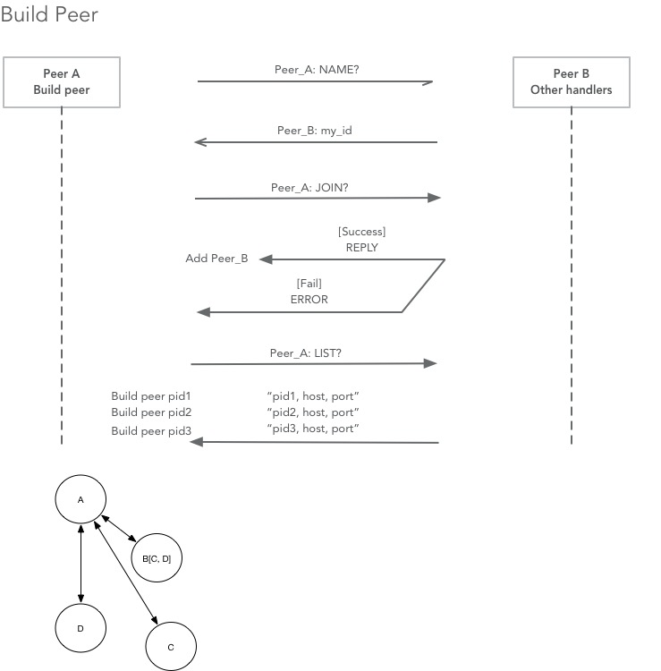

[http://cs.berry.edu/~nhamid/p2p/](http://cs.berry.edu/~nhamid/p2p/)

### 1. BTPeer class

Define the attributes and main event handle logic for a peer.

##### a. Attributes：
* `_my_id`: string
* `server_host`: string
* `server_port`: int
* `peers`: list
* `max_peers`: int

Functions:
* `my_id`: get & set _my_id
* `add_peer`, `get_peer`, `remove_peer`, `add_peer_at`, `get_peer_at`, `remove_peer_at`, `get_all_peers`, `peer_nums`: operate on peers list
* `max_peers_reached`: max_peers


##### b. Peer logic：
* `shut_down`: bool
* `handlers`: list
* `router`

Functions:
* `main_loop`: Listen connections on the server port, dispatch them to `_handle_peer`.
* `_handle_peer`: Dispatch requests to different API function according to message types.
* `send_to_peer`: Send message to the identified peer.
* `connect_and_send`: Connect to peers and wait for reply
* `check_live_peers`: Delete offline peers.

### 2. BTPeerConnection class

Encapsulate socket objects, pack/unpack/chunk messages, catch exceptions

Attributes:

`id`, `sock`

Connection logic:

`make_msg`, `send_data`, `recv_data`, `close`

### Debug

```python
msg = struct.pack('!4sL%ds' % msg_len, msg_type, msg_len, msg_data)
%d format the first following param, (msg_type, msg_len, msg_data)
```

### 3. FilerPeer

##### a. Attributes：

* `files`: list
* `handlers`: dict for handlers
* `add_router`: add known peers from others 

##### b. Handlers:
* `__handle_insertpeer(JOIN)`: insert peers to list, return Error if fails
* `__handle_listpeers(LIST)`: reply with the known peers
* `__handle_peername(NAME)`: reply with its peer_id 
* `__handle_query(QUER)`
* `__handle_qresponse(RESP)`
* `__handle_fileget(FGET)`
* `__handle_peerquit(QUIT)`
* `build_peers`: handle reaction from peers



